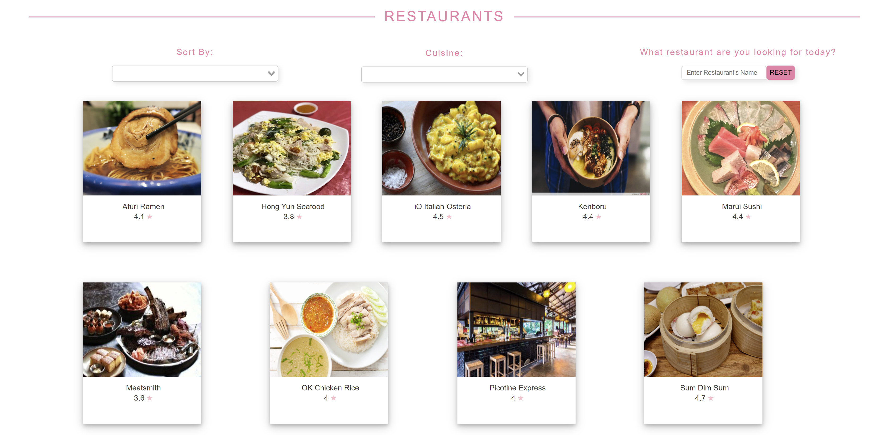
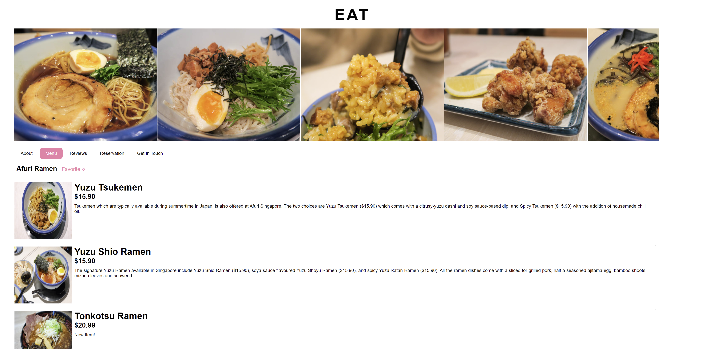

# eat-shop

## Description
Eat & Shop is a services booking platform for small local businesses.

https://eat-shop.herokuapp.com/





## Project setup
```
npm install
```

### Compiles and hot-reloads for development
```
npm run serve
```

### Compiles and minifies for production
```
npm run build
```

### Lints and fixes files
```
npm run lint
```

### Customize configuration
See [Configuration Reference](https://cli.vuejs.org/config/).

## Authors

* **Wong Wei Kang** - [wwongwk](https://github.com/wwongwk)
* **Yeo Yu Zhen** - [yuzhen26](https://github.com/yuzhen26)
* **Xue Xiaodong** - [HaileyXue](https://github.com/HaileyXue)
* **Wee Shaun** - [KyXuan229](https://github.com/KyXuan229)
* **Wang Fei** - [wangfeiii](https://github.com/wangfeiii)
